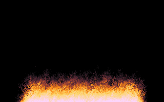

# HTML Canvas pixel manipulation example
A burning fire demonstration written in vanilla Javascript.
This demonstrates how to use pixel manipulation in an HTML canvas.
The original BURN.PAS Pascal source code by Frank Jan Sorensen Alias:Frank Patxi is also included.

